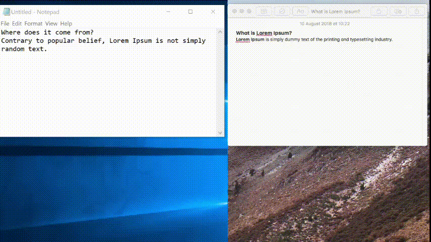

Clipmir (Currently only for testing!)
=====================================

A cross platform Electron app for mirroring the clipboard between all synced devices in the same network.

Demo
----



Download
--------

* Windows (x64): [Squirrel](https://bintray.com/tiagovtristao/windows/download_file?file_path=clipmir-desktop-setup.zip), [MSI](https://bintray.com/tiagovtristao/windows/download_file?file_path=clipmir-desktop-msi.zip)
* MacOS (x64): [ZIP](https://bintray.com/tiagovtristao/macos/download_file?file_path=clipmir-desktop-darwin-x64-0.0.1.zip)
* Linux (x64): [DEB](https://bintray.com/tiagovtristao/linux/download_file?file_path=clipmir-desktop_0.0.1_amd64.deb), [RPM](https://bintray.com/tiagovtristao/linux/download_file?file_path=clipmir-desktop-0.0.1.x86_64.rpm)

Development
-----------

```bash
git clone https://github.com/tiagovtristao/clipmir-desktop.git
cd clipmir-desktop
yarn install (or npm install)
yarn start (or npm run start)
```

Build
-----

```bash
git clone https://github.com/tiagovtristao/clipmir-desktop.git
cd clipmir-desktop
yarn install (or npm install)
yarn make (or npm run make)
```
> **NOTE**
> 
> `yarn make` will produce a build based on your arch and OS. See https://electronforge.io/cli/make if you want to build for a different arch and/or OS.

Motivation
----------

Every now and then, I feel the need of copying some text into the clipboard and have it readily available for pasting in another computer in the same network. It's not ideal for me to paste what I have just copied into another program (i.e. emails, Slack, etc.) in the very same computer so that it can get sent "across".

Truth is, although I used to need this functionality more in the past, I rarely need it nowadays. So, would I go about installing an app in each device where I need this, when I might not use it everyday? Probably not, as any of the solutions mentioned above would do just fine.

So why did I go about building a first working version (currenly only for testing!), when there might already be similar solutions out there as well? Well, I did it for fun, knowing that I'd learn new things along the way too. Also, there might be someone out there who this project could pick his/her interest.

How it works
------------

* When the app is launched on the first device, it will notify the network - using SSDP (Simple Service Discovery Protocol) - that it is providing this clipboard mirroring service;
* The exactly same thing will happen, when the app is launched on the second device;
* At this point, the app in each device will list the other device;
* In order to have the devices' clipboards synced, both devices have to click in each other's name in the list to establish a bi-directional flow - a green circle will appear indicating that both devices agreed to talk to each other;
* If a device tries to connect with another one, but the target device doesn't connect back (by clicking on the device name in the list), then no connection is established and nothing happens;
* Several devices can be connected at the same time, allowing one device to broadcast its new clipboard value to everyone connected to it.

Limitations
-----------

* Only text can be synced, at the moment.

Current State
-------------

This is the first minimal working version, and should be used for testing only! The features missing to make it to a secure and stable version are:

* The current advertised name by a device is a UUID, which makes it difficult to know who that user is if there are more than 2 advertisers in the network. There should be an option to allow the user to set its discovery name;
* There isn't a visual indicator in the UI when someone tries to connect to you and vice versa;
* There's no disconnect option from a device, unless you restart the app;
* The state of a device that you are connected to is not reflected on the UI when it goes offline;
* Move server initialisation from the rendered process into the main process (Electron);
* The JSON RPC server should be serving HTTPS instead HTTP.

Future
------

The basic functionality is up and running which covers the initial goal of this project. There are no plans to tackle the issues mentioned in "Current State", unless there are people interested. By the way, you are more than welcome to make pull requests :-)

Mobile support was initially considered too, so that users could have their computer and phone's clipboards also synced. And although this project targets desktop devices only, most of the code could probably be ported to React Native to achieve it.

Electron could be switched by native APIs since it's overkill for such a small program.

License
-------

MIT
